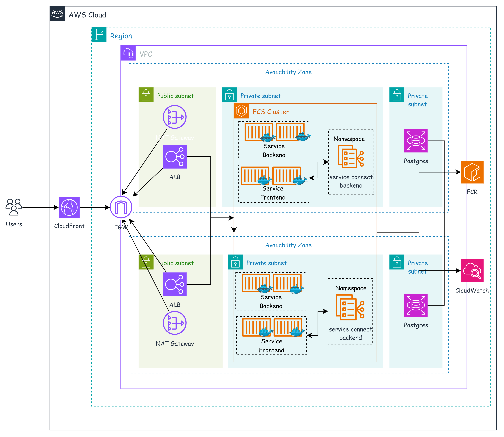

# SRE Technical Interview Exercise - URL Shortener & Analytics Platform

[](https://developer.mozilla.org/en-US/docs/Web/JavaScript)
[](https://opentofu.org/)
[](https://terragrunt.gruntwork.io/)
[](https://aws.amazon.com/)
[](#-license)

<br>
<div align="center">
  <p align="center">
    <strong>SRE Technical Interview (Banking Sector)</strong><br>
    A production-ready, highly reliable URL shortener & click analytics service engineered to satisfy enterprise reliability, security, and compliance standards.
  </p>
</div>

## 📋 Table of Contents
- [📖 About](#-about)
- [🏗️ Architecture & Request Flow](#️-architecture--request-flow)
- [🚀 Quick Start (Local Development)](#-quick-start-local-development)
- [📦 Installation & Deployment](#-installation--deployment)
- [🏦 Reliability & Security Strategy](#-reliability--security-strategy)
- [📊 Observability & SLI/SLO Framework](#-observability--slislo-framework)
- [📁 Repository Layout](#-repository-layout)
- [🧭 Roadmap](#-roadmap)
- [🤝 Contributing](#-contributing)
- [📄 License](#-license)
- [📬 Contact](#-contact)

## 📖 About

In this project, we **build, secure, and deploy a production-grade URL shortener** end-to-end. Beyond serving simple redirects, this project models the core concerns an SRE owns in a financial institution: **resilience, security controls, automated infrastructure, zero-downtime deployments, and real-time observability**.

### Key Highlights
- **Application Stack:** NestJS API + Next.js Frontend + PostgreSQL database, fully containerised with multi-stage Dockerfiles.
- **Cloud Infrastructure:** Provisioned on AWS using **ECS Fargate** behind an Application Load Balancer (ALB) and CloudFront CDN, backed by **AWS RDS PostgreSQL** in private subnets.
- **Infrastructure as Code (IaC):** Modular, reproducible infrastructure managed with **Terragrunt + OpenTofu**.
- **Keyless CI/CD Pipeline:** GitHub Actions authenticating to AWS strictly via **AWS OIDC (OpenID Connect)**, completely eliminating long-lived IAM credentials.

### Built With

* [![NestJS][nestjs-shield]][nestjs-url]
* [![Next.js][nextjs-shield]][nextjs-url]
* [![PostgreSQL][postgres-shield]][postgres-url]
* [![Docker][docker-shield]][docker-url]
* [![OpenTofu][tofu-shield]][tofu-url] [![Terragrunt][terragrunt-shield]][terragrunt-url]
* [![AWS][aws-shield]][aws-url]
* [![GitHub Actions][gha-shield]][gha-url]
* [![k6][k6-shield]][k6-url]

## 🏗️ Architecture & Request Flow

### Request Flow Breakdown
1. **Edge entry:** HTTPS requests hit **CloudFront**, the single public HTTPS entry point (TLS termination at the edge).
2. **Ingress & routing:** Requests pass through the **ALB**, which performs path-based routing (`/api/*` → backend, everything else → the Next.js frontend). *(A WAF web ACL is planned - see [Roadmap](#-roadmap).)*
3. **Application Execution:** Traffic reaches **ECS Fargate** tasks running inside private subnets with no public IP exposure.
4. **Data Persistence:** Persistent URL mappings and click telemetry are stored in **AWS RDS PostgreSQL** deployed in private database subnets.

## 🚀 Quick Start (Local Development)

You can spin up the full stack locally (frontend, backend API, and database) with Docker Compose in two commands.

### Prerequisites
- [Docker Desktop](https://www.docker.com/) (v20+)
- [Node.js](https://nodejs.org/) 20 LTS - optional, only to run app scripts outside Docker

### 2-Step Setup

Docker (Compose v2) is the only host dependency - Postgres, the backend and the frontend all run in
containers, with sensible defaults baked into Compose (no manual `.env` needed).

1. **Clone the repository:**
   ```bash
   git clone https://github.com/bkdafexpert/sre-interviews.git
   cd sre-interviews
   ```

2. **Launch the stack:**
   ```bash
   cd applications && docker compose up --build
   ```

Open the UI at `http://localhost:3000` and sign in with **Continuer avec Google**; the API health
probe is at `http://localhost:4000/api/health`. On first boot the backend pushes the schema
(`prisma db push`) and seeds a demo account with ~30 days of click events, so the dashboards are
populated immediately. Stop and wipe data with `docker compose down -v`.

Per-service `.env.example` files (`applications/backend`, `applications/frontend`) document the knobs
if you run a service outside Docker.

## 📦 Installation & Deployment

### Build the images (optional - without running)

```bash
cd applications && docker compose build
```
The backend runs `nest build`, the frontend `next build`, each in its own multi-stage `Dockerfile`, so the host never compiles anything. CI builds the same images and pushes them to ECR.

### Infrastructure Provisioning (OpenTofu + Terragrunt)

**Prerequisites:** [OpenTofu 1.12.5 + Terragrunt 1.1.1](infrastructure/.tool-versions) (install via
`mise install` or `asdf install`), [**Task**](https://taskfile.dev) (the `task` runner), and AWS
credentials for the target account.

All AWS infrastructure is managed reproducibly with Terragrunt wrapping OpenTofu.

> ⚠️ **Run `task bootstrap:apply` once before any provisioning.** It creates the GitHub OIDC provider
> and the keyless CI roles. CI cannot bootstrap its own trust (self-lockout risk), so this one-off
> step is applied locally by an operator with admin credentials; without it the provisioning
> pipelines have no role to assume.

```bash
task bootstrap:apply   # ONE-OFF: OIDC provider + CI roles (local, admin credentials)
task infra:plan        # preview the whole environment (dependency order)
task infra:apply       # create / update everything
```

See [`infrastructure/README.md`](infrastructure/README.md#usage) for the dependency graph and the
first-apply placeholders.

### Keyless CI/CD Pipeline (GitHub Actions + AWS OIDC)

The pipeline enforces strict controls:
- **No static credentials**: authenticates to AWS via short-lived roles assumed through the GitHub **OIDC** trust; no long-lived keys anywhere.
- **Automated validation**: `commitlint` + `actionlint`, IaC static analysis (`tofu fmt` / `tflint` / `checkov`), app lint + tests, and ECR scan-on-push before deployment.
- **Zero-downtime rolling deployment**: ECS updates tasks incrementally, gated on ALB target-group health (`/api/health`).

<!-- RELIABILITY & SECURITY -->
## 🏦 Reliability & Security Strategy

Reliability and security are designed in, not bolted on. In place today:

**Security**
- **Keyless CI/CD**: GitHub Actions assumes short-lived roles via **AWS OIDC**; no long-lived IAM keys exist anywhere. CI roles are least-privilege (separate app-deploy / infra read-write / infra read-only).
- **Secrets in AWS Secrets Manager**: the RDS password and the app JWT secret are generated by Terraform and injected at runtime, never committed.
- **Network isolation**: ECS tasks run in **private subnets** with no public IP; **RDS** sits in isolated database subnets whose route table has **no NAT route** (zero outbound internet). A tight security-group chain allows only `ALB → app → db`.
- **Encryption & TLS**: RDS encrypted at rest; HTTPS terminated at **CloudFront**; ECR images scanned on push.

**Reliability**
- **Multi-AZ**: VPC, ALB, ECS services and RDS span two Availability Zones.
- **Zero-downtime deploys**: ECS rolling updates gated on ALB target-group health (`/api/health`); the **deployment circuit breaker** automatically rolls back to the last healthy task set if a rollout fails to stabilise.
- **Backups**: RDS automated backups with 7-day point-in-time recovery.
- **Autoscaling**: CPU target-tracking on the Fargate services.
- **SLOs & error budgets**: reliability is quantified up front (see below) and enforced by the k6 load-test gate in CI.

Planned hardening (see [Roadmap](#-roadmap)): lock the ALB behind CloudFront + a **WAF**, an **ACM** cert & custom domain, and multi-window burn-rate SLO alerting.

<!-- OBSERVABILITY -->
## 📊 Observability & SLI/SLO Framework

Reliability is defined up front and measured against these targets. The **redirect**
(`GET /:code`) is the high-throughput hot path, so it carries the tighter objective:

| Journey | SLI (indicator) | SLO (target, 28-day window) |
| --- | --- | --- |
| **Redirect** `GET /:code` | Availability - non-5xx / total | **99.9 %** |
| **Redirect** `GET /:code` | Latency - requests served under 200 ms | **99 %** (p99 < 200 ms) |
| **API** (links, stats) | Availability - non-5xx / total | **99.5 %** |
| **API** (links, stats) | Latency - requests served under 500 ms | **95 %** (p95 < 500 ms) |

The 99.9 % availability SLO leaves an **error budget of ≈ 40 min / 28 days**; sustained burn is what
pages, not a single failed request.

**Alarms (CloudWatch, as code)**: each maps to an SLI above:

| Alarm | Metric | Fires when | Protects |
| --- | --- | --- | --- |
| App 5xx | ALB `HTTPCode_Target_5XX_Count` | error rate over 5 min exceeds budget | availability |
| Edge 5xx | ALB `HTTPCode_ELB_5XX_Count` | sustained > 0 (LB/target unreachable) | availability |
| Latency | ALB `TargetResponseTime` (p99) | p99 > 200 ms sustained | latency |
| Capacity | ECS `RunningTaskCount` (per service) | running < desired for N min | availability |
| Error-budget burn *(planned)* | composite 5xx rate | fast-burn (2 %/1 h) **or** slow-burn (5 %/6 h) | SLO burn |
| Datastore | RDS `CPUUtilization` / `FreeStorageSpace` / `DatabaseConnections` | high CPU / low storage / connection saturation | datastore health |

**Dashboard (as code)**: one pane per tier:

* **ALB**: request count, 2xx/3xx/4xx/5xx split, target response time (p50 / p99).
* **ECS**: CPU & memory per service, running vs desired tasks, deployment events.
* **RDS**: CPU, connections, free storage, read/write latency.
* **App SLIs**: redirect latency, error rate, and `ClickEvent` throughput.

The k6 load test uses these same SLOs as its pass/fail thresholds, so a regression below target
fails CI.

<!-- REPOSITORY LAYOUT -->
## 📁 Repository Layout

```
sre-interviews/
├── applications/          # the product - see applications/README.md
│   ├── backend/           #   NestJS API (Prisma + PostgreSQL)
│   ├── frontend/          #   Next.js App Router UI
│   ├── loadtest/          #   k6 user-journey load test (SLO gate)
│   └── docker-compose.yml #   postgres + backend + frontend
├── infrastructure/        # IaC - Terragrunt/OpenTofu - see infrastructure/README.md
│   ├── modules/<cloud>/   #   reusable modules, grouped by cloud
│   └── live/<cloud>/      #   Terragrunt live config (account / region / env)
├── .github/workflows/     # CI/CD: ci-app · cd-app · ci-infra · cd-infra · checks · load-test
├── Taskfile.yml           # local operator tasks (OIDC-layer bootstrap)
├── .pre-commit-config.yaml# local mirror of the CI static-analysis gate
└── .releaserc.json        # semantic-release config
```

<!-- ROADMAP -->
## 🧭 Roadmap

> ⏱️ **Engineering note:** this exercise was built under a **4-hour** constraint, so priority went to
> the critical foundations - reproducible IaC, keyless access (OIDC), containerisation, and baseline
> observability. The tiers below make the trade-offs explicit.

### 🎯 Shipped - MVP (within the 4h scope)
- [x] **Architecture as code**: multi-AZ VPC, ECS Fargate, ALB, RDS PostgreSQL & Secrets Manager via OpenTofu / Terragrunt.
- [x] **Secure CI/CD (OIDC)**: GitHub Actions with no static AWS keys (auth via GitHub OIDC).
- [x] **Containerisation & app**: multi-stage Docker images (NestJS + Next.js), environment injected cleanly.
- [x] **SLIs / SLOs defined**: availability & latency objectives with an error budget (see the Observability section).
- [x] **Baseline observability & health checks**: `/api/health` probe + structured logs to CloudWatch.
- [x] **Automated backups**: RDS automated backups with 7-day point-in-time recovery.
- [x] **Zero-downtime deployment**: ECS rolling deploy gated on ALB health checks, with deployment-circuit-breaker auto-rollback.

### 🚀 Next priorities (given +24h)
- [ ] **Network & edge hardening**: restrict the ALB security group to the CloudFront origin prefix list + a WAF web ACL.
- [ ] **SLO / error-budget alerting**: multi-window burn-rate CloudWatch alarms on the redirect 5xx rate.
- [ ] **Redis / ElastiCache cache**: offload hot redirect reads to hold sub-10 ms resolution under load.

### 🛑 Deliberately out of scope (trade-offs / SRE backlog)
- **Multi-region DR & chaos engineering**: deliberately dropped to keep the MVP operationally simple.
- **Progressive delivery (canary / blue-green)**: a standard ECS rolling update with circuit-breaker auto-rollback is used instead.

<!-- CONTRIBUTING -->
## 🤝 Contributing

This repo is graded in part on **commit clarity**: history must read as a deliberate progression.

* Commits follow **[Conventional Commits](https://www.conventionalcommits.org/)**
  (`feat:`, `fix:`, `ci:`, `docs:`, …); `commitlint` enforces the format.
* **[semantic-release](https://semantic-release.gitbook.io/)** derives versions and release notes
  from those commits on `main` (`.releaserc.json`).
* Run the **pre-commit** hooks locally so the CI static-analysis gate passes first time
  (`pre-commit install` - see [`.pre-commit-config.yaml`](.pre-commit-config.yaml)).

Standard flow:

1. Create a branch (`git checkout -b feat/amazing-thing`)
2. Commit with a Conventional Commit message (`git commit -m 'feat: add amazing thing'`)
3. Push and open a Pull Request

<!-- LICENSE -->
## 📄 License

Unlicensed - private SRE interview exercise. Not distributed under an open-source license.

<!-- CONTACT -->
## 📬 Contact

Ben Kone - benkone@astrelya.com

Project structure & docs: [`applications/README.md`](applications/README.md) · [`infrastructure/README.md`](infrastructure/README.md)

<!-- MARKDOWN LINKS & IMAGES -->
[javascript-shield]: https://img.shields.io/badge/JavaScript-F7DF1E?style=for-the-badge&logo=javascript&logoColor=black
[javascript-url]: https://developer.mozilla.org/en-US/docs/Web/JavaScript
[license-shield]: https://img.shields.io/badge/license-Unlicensed-lightgrey?style=for-the-badge
[license-url]: #-license
[tofu-shield]: https://img.shields.io/badge/OpenTofu-FFDA18?style=for-the-badge&logo=opentofu&logoColor=black
[tofu-url]: https://opentofu.org/
[terragrunt-shield]: https://img.shields.io/badge/Terragrunt-1A5C97?style=for-the-badge&logo=gradle&logoColor=white
[terragrunt-url]: https://terragrunt.gruntwork.io/
[aws-shield]: https://img.shields.io/badge/AWS-232F3E?style=for-the-badge&logo=amazonwebservices&logoColor=white
[aws-url]: https://aws.amazon.com/
[nestjs-shield]: https://img.shields.io/badge/NestJS-E0234E?style=for-the-badge&logo=nestjs&logoColor=white
[nestjs-url]: https://nestjs.com/
[nextjs-shield]: https://img.shields.io/badge/Next.js-000000?style=for-the-badge&logo=nextdotjs&logoColor=white
[nextjs-url]: https://nextjs.org/
[postgres-shield]: https://img.shields.io/badge/PostgreSQL-4169E1?style=for-the-badge&logo=postgresql&logoColor=white
[postgres-url]: https://www.postgresql.org/
[docker-shield]: https://img.shields.io/badge/Docker-2496ED?style=for-the-badge&logo=docker&logoColor=white
[docker-url]: https://www.docker.com/
[gha-shield]: https://img.shields.io/badge/GitHub%20Actions-2088FF?style=for-the-badge&logo=githubactions&logoColor=white
[gha-url]: https://github.com/features/actions
[k6-shield]: https://img.shields.io/badge/k6-7D64FF?style=for-the-badge&logo=k6&logoColor=white
[k6-url]: https://k6.io/
